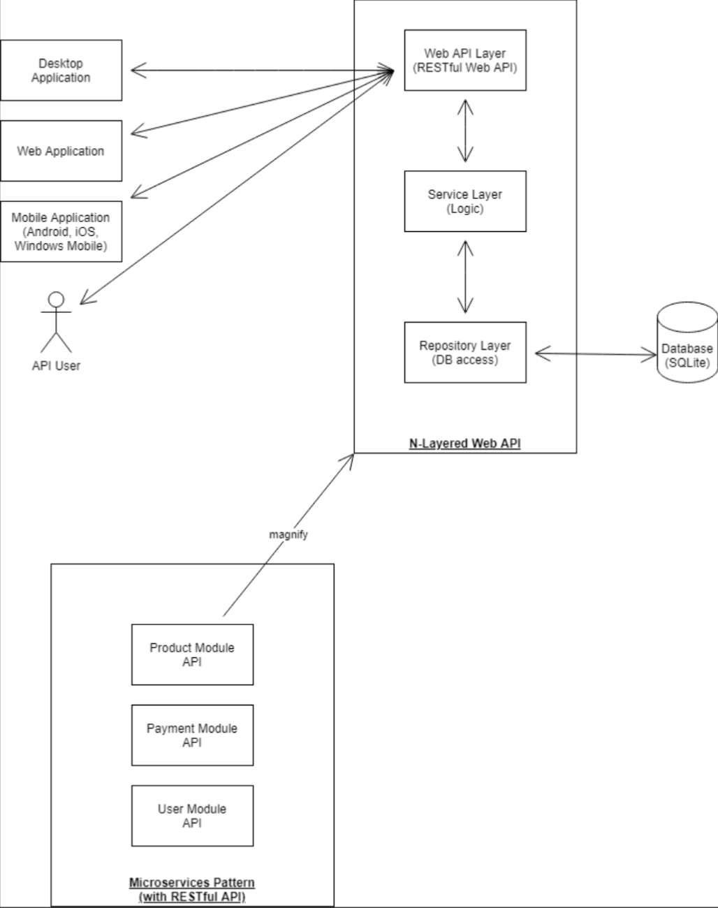

# Apex Restaurant

## Introduction
A project built on top of N-layer architecture, following the best practices using ASP.NET Core MVC.
This project demonstrates the building of a RESTful Web API with N-layers, e.g. Web API Layer, Service Layer, Repository Layer. 

This can be used as a backend to build any type of application like desktop application.Web application (React UI, Angular UI, ASP.NET MVC/Core, Laravel, etc.), Mobile Application (Android, iOS, Windows Mobile, etc.)

## Architecture


## Setup
1. Git clone
```
git clone https://github.com/bishwo633/apexrestaurant
```

2. Setup

2.1 [Dotnet core](https://dotnet.microsoft.com/en-us/download)
Setup and check version
```
dotnet --version
8.0.100
```

2.2 Database migration tool
- Install the tools for [EF Core Command Line Tools](https://learn.microsoft.com/en-us/ef/core/cli/)
- Make sure its in your path: `export PATH=$PATH:~/.dotnet/tools`
- `dotnet ef migrations add initial_create`
- `dotnet ef database update`

3. Build
Make sure there are no errors
```
dotnet build
```

4. Run
```
dotnet run
```

5. Test
https://localhost:{port}/swagger
